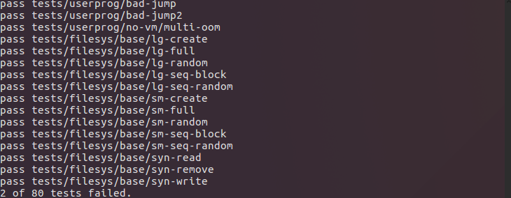

# OS Project 2 User Program Report

11611209 徐逸飞
11611225 陈苏秦

## Data structure  

### thread.h

Modified the structure of thread:

```c

    tid_t parent_id;
    uint32_t *pagedir;
    struct list children;
    struct list fd_list;
    int exit_status;
    struct file *executable;  

```

### syscall.c  

In syscall.c, we use the `struct intr_frame* f` to transfer the message.  
Added the following functions:  

```c

    void sys_halt(struct intr_frame* f);  
    void sys_exit(struct intr_frame* f);  
    void sys_exec(struct intr_frame* f);  
    void sys_wait(struct intr_frame* f);  
    void sys_create(struct intr_frame* f);
    void sys_remove(struct intr_frame* f);
    void sys_open(struct intr_frame* f);  
    void sys_filesize(struct intr_frame* f);
    void sys_read(struct intr_frame* f);  
    void sys_write(struct intr_frame* f);
    void sys_seek(struct intr_frame* f);  
    void sys_tell(struct intr_frame* f);  
    void sys_close(struct intr_frame* f);
    void halt (void) ;
    void exit (int status) ;
    pid_t exec (const char *file);
    int wait (pid_t);
    bool create (const char *file, unsigned initial_size);
    bool remove (const char *file);
    int open (const char *file);
    int filesize (int fd);
    int read (int fd, void *buffer, unsigned length);
    int write (int fd, const void *buffer, unsigned length);
    void seek (int fd, unsigned position);
    unsigned tell (int fd);
    void close (int fd);

    static struct file *find_file_by_fd (int fd);
    static struct fd_entry *find_fd (int fd);
    static int alloc_fid (void);
    static struct fd_entry *find_fd_by_fd (int fd);

    static void (*syscall_handlers[SYS_CALL_NUM])(struct intr_frame *);  

```  

The methods are aimed to handle different system calls.  

## Algorithms  

The argument passing algorithm:  
For the process_execute():

```c

char *name, *saved_ptr;
name = strtok_r(file_name," ",&saved_ptr);
/*the name is the program name*/
tid = thread_create(name, PRI_DEFAULT, start_process, fn_copy);
/*create the new thread*/

```

Then we put other arguments into the user stack. The user stack pointer is ```if_.esp```Since the stack grows down, the string  grows up. So we should carefully deal with the pointer and the data.  
Firstly, we take out the arguments:

```c

esp = if_.esp;//store the pointer
char *args[265];//store the arguments
while (saved_ptr not NULL, take the separate argument into token)
    strcpy(esp, token, strlen(token) + 2)
    args[n++] = esp;//n starts from n, represents the argc
    /*store the arguments and store the corresponding address.*/
end while
```

After store the data into user stack, we need to put their addresses into stack in sequence.  
Before this, we need to modify the pointer address.

```c

while (esp % 4 not equals 0)
    esp--;
end while
/*make sure the esp is a multiple of 4*/
*(esp - 4) = 0;//avoid there is no arguments
*--p = esp - 4;

for i = n to 0
  *p-- = args[i]// store the data address into the stack.
end for
//put the argc, argv into the stack
*--p = p + 1;
*--p = n;
*--p = 0;
//set the pointer points to the new top of the stack
if_.esp = p ;
```

## Synchronization  

    The filesystem is thread safe.


## Rationale  

The advantages we think of our codes is that we separate the frequently used codes into method. In this way, we can avoid many copies. Also we use the structure to store the information of the thread, which can be used for any programs and no need to worry about the information missing.

How much code written:  
threads/thread.c | 13  
threads/thread.h | 26 +  
userprog/exception.c | 8  
userprog/process.c | 210 ++++++++++++++--  
userprog/syscall.c | 447 ++++++++++++++++++++++++++++++-  
userprog/syscall.h | 1  

### A reflection on the project–what exactly did each member do? What went well, and what could be improved?

    The work 陈苏秦 does is to implement the part of system call.
    The work 徐逸飞 does is to implement the part of argument passing and filesystem.  

    Some easy task of system call went well, but some complex tasks are difficult. And they are hard to debug in pintos.  
    What need to be improved is that the design logic and the code style. Also, some special conditions are not considered.

    And to figure out how the  user stack pointer works also takes a lot of time. So we spend much time to make it clear.

### Does your code exhibit any major memory safety problems (specially regarding strings), memory leaks, poor error handling, or race conditions?

    Yes. We take it into consideration.

### Did you use consistent code style? Your code should blend in with the existing Pintos code. Check your use of indentation, your spacing, and your naming conventions.

    The code style may not all match with the pintos code, for some long method name, I named them in a shorter way.  

### Is your code simple and easy to understand?

    Relatively easy to understand.

### If you have very complex sections of code in your solution, did you add enough comments to explain them?

    The code is not so complex in implementation, we have few comments.

### Did you leave commented-out code in your final submission?

    I think we didn't.

### Did you copy-paste code instead of creating reusable functions?

    No. We separate the duplicate code into different methods.

### Are your lines of source code excessively long? (more than 100 characters)

    No.

### Did you re-implement linked list algorithms instead of using the provided list manipulation

    No.
